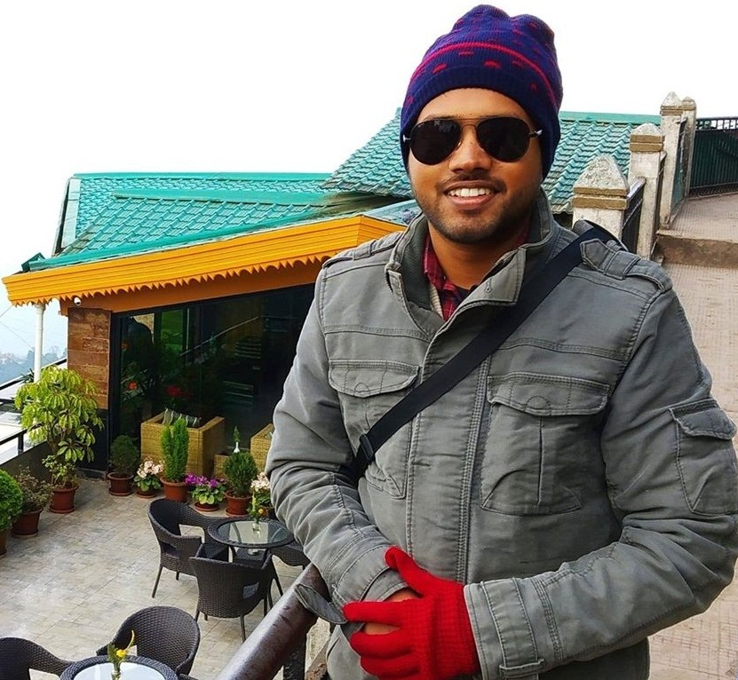
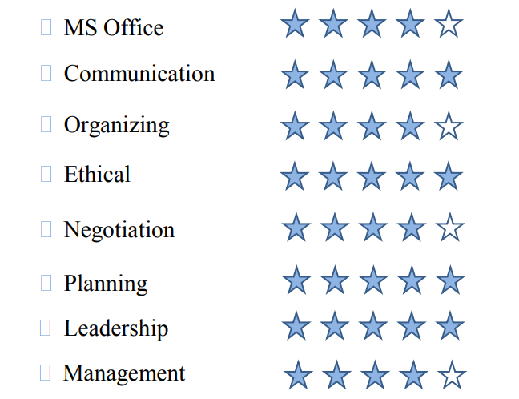

<!doctype html>
<html lang="en">
  <head>
    <!-- Required meta tags -->
    <meta charset="utf-8">
    <meta name="viewport" content="width=device-width, initial-scale=1, shrink-to-fit=no">

    <!-- Bootstrap CSS -->
    <link rel="stylesheet" href="https://stackpath.bootstrapcdn.com/bootstrap/4.4.1/css/bootstrap.min.css" integrity="sha384-Vkoo8x4CGsO3+Hhxv8T/Q5PaXtkKtu6ug5TOeNV6gBiFeWPGFN9MuhOf23Q9Ifjh" crossorigin="anonymous">

    <title>Anindya Abeer Saha Profile</title>
    
  </head>
  <body>
    <nav id="navigation" class="navbar navbar-expand-lg navbar-dark bg-black sticky-top">
       
        

          <ul class="navbar-nav">
            <li class="nav-item active">
              <a class="navbar-brand" class="nav-link" href="Anindya.html"><b>Home</b> (current)</a>
            </li>
            <li>
                <a  class="navbar-brand" href="#about"><b>Who I Am</b></a>
                <button class="navbar-toggler" type="button" data-toggle="collapse" data-target="#navbarNavDropdown" aria-controls="navbarNavDropdown" aria-expanded="false" aria-label="Toggle navigation">
                  
                </button>
            </li>
            <li class="nav-item">
              <a class="nav-link" href="#education"><b>Academic Profle</b></a>
            </li>
            <li class="nav-item">
                <a class="nav-link" href="#hobbies"><b>Hobbies</b></a>
              </li>
              <li class="nav-item">
                <a class="nav-link" href="#co-act"><b>Co-curricular Activities</b></a>
              </li>
              <li class="nav-item">
                <a class="nav-link" target="_blank" href="Anindya'sCV.pdf"><b>My CV</b></a>
              </li>
            <li class="nav-item">
              <a class="nav-link" href="phovi.html"><b>Photos & Videos</b></a>
            </li>
            <li class="nav-item">
                <a class="nav-link" href="contact.html"><b>Contact Me</b></a>
              </li>
            <li class="nav-item dropdown">
              <a class="nav-link dropdown-toggle" href="#" id="navbarDropdownMenuLink" role="button" data-toggle="dropdown" aria-haspopup="true" aria-expanded="false">
               <b>Social Links</b></a>
              

                <a class="dropdown-item" target="_blank" href="http://www.linkedin.com/in/anindya-abeer-saha-363002b7">Linkedin</a>
                <a class="dropdown-item" target="_blank" href="http://www.facebook.com/anindyaabeersaha">Facebook</a>
                <a class="dropdown-item" target="_blank" href="https://www.instagram.com/anindya_abeer_saha">Instagram</a>
                <a class="dropdown-item" target="_blank" href="https://mail.google.com/mail/u/0/#inbox?compose=CllgCJfnbcvfbGtBgQFtSQZNxLFxRPlvFHkNtQvGkqlcgdCRRftQwjfhBTLJpPnVnfwQwWNJcgB">Email</a>
              

            </li>
          </ul>
        

      </nav>
    

        <ol class="carousel-indicators">
          <li data-target="#carouselExampleIndicators" data-slide-to="0" class="active"></li>
          <li data-target="#carouselExampleIndicators" data-slide-to="1"></li>
          <li data-target="#carouselExampleIndicators" data-slide-to="2"></li>
        </ol>
        

          

            
          

          

            
          

          

            
          

        

        <a class="carousel-control-prev" href="#carouselExampleIndicators" role="button" data-slide="prev">
          
          Previous
        </a>
        <a class="carousel-control-next" href="#carouselExampleIndicators" role="button" data-slide="next">
          
          Next
        </a>
      

      

          
        

        
            <h1 class="display-4">Anindya Abeer Saha</h1>
            
Student

            

            
I am a Student

           
           
           
           
          

                
              

              

                

                  <h4 class="card-header">Academic Profile</h4>
                  

                   <ul> 
                     <li><h5 class="card-title"><b><mark>BBA, Major in Finance</mark></b></h5>
                    
<b>East West University</b>  <small>(2014-2019)</small>

                    
                    <a href="#" class="btn btn-primary">See in Details</a></li>
                     
                    
                  <li><h5 class="card-title"><b><mark>HSC</mark></b></h5>
                    
<b>Notre Dame College</b> 
                      <small>(2012-2014)</small>

                    <a href="#" class="btn btn-primary">See in Details</a></li>
                     
                    
                  <li> <h5 class="card-title"><b><mark>SSC</mark></b></h5>
                    
<b>National Bank Public School & College</b> 
                      <small>(2006-2011)</small>

                    <a href="#" class="btn btn-primary">See in Details</a></li></ul>
                  

                
    
            

            

              

               <h4 class="card-header">
Co-curricular Activities
</h4>
                

                <table  align="center" id="table""> 
                   <tr valign="top"><ul>
                    <td><li> <h5 class="card-title"><mark>President</mark></h5>
                  
Agro Industrialization Club,

                  
<b>East West University</b> <small>(2017-2018)</small>

                  <a href="#" class="btn btn-primary">Club Activities</a></li></td>
                  <td> </td><td> </td><td> </td><td> </td><td> </td><td> </td><td> </td><td> </td><td> </td><td> </td><td> </td><td> </td><td> </td><td> </td><td> </td>
                <td> <li> <h5 class="card-title" ><mark>Activation Member</mark></h5>
                    
<b>Light of Hopes Youth  Foundation</b> <small> an initiative for the unprivileged  
                      People of Bangladesh</small>
</li></td> </tr>
                      
                    <tr valign="top"><td> <li> <h5 class="card-title"><mark>Associate Member</mark></h5>
                  
Book Reading Activities,

                  
<b>Bishwosahitya Kendro,  Dhaka</b> <small>(2006-2010)</small>
</li></td>
                  <td> </td><td> </td><td> </td><td> </td><td> </td><td> </td><td> </td><td> </td><td> </td><td> </td><td> </td><td> </td><td> </td><td> </td><td> </td>

                <td> <li> <h5 class="card-title"><mark>Coordinator</mark></h5>
                      
<b>East West Bidyaniketon</b>  <small>A
                        Primary school for unprivileged  children of Aftabnagar, authorized 
                         by East West University</small>
</li> </ul></td></tr></table>
                

              

            

            

              

                  

                    
                    

                      <h5 class="card-title">Card title</h5>
                      
This is a wider card with supporting text below as a natural lead-in to additional content. This content is a little bit longer.

                    

                  

                  

                    
                    

                      <h5 class="card-title">Card title</h5>
                      
This card has supporting text below as a natural lead-in to additional content.

                    

                  

                  

                    
                    

                      <h5 class="card-title">Card title</h5>
                      
This is a wider card with supporting text below as a natural lead-in to additional content. This card has even longer content than the first to show that equal height action.

                    

                  

                  

                    <h2>

</h2>
                    

                  

                  

                    <h3 id="quote"><b>
My Favourite Quote</b>
</h3>
                    
                    

                    <big><q>Experience is the hardest kind of teacher;  It gives you the test first and lesson afterward</q> <b>- Oscar Wilde</b></big>

                    

                    

                      <h3 id="philo">life philosophy</h3>
                     

 <q><big> I always want to make things easier instead of harder and never apologize for being correct.</big></q>

                       

                    

                    

                      
                      

                        

                          

                            

                              

                                <h4 class="card-title">Contact Me</h4>
                                
  Email: anindyaabeersaha@gmail.com

                                
  Mobile: +8801760760313

                               
                              

                            

                          

                          

                            

                              

                                <h4 class="card-title">My Blood Group</h4>
                                
<blink><h3>O+</h3></blink>

                                
<small> For emergency importance of Blood, Contact me.</small>

                                
                              

                            

                            
                          

                          

                           <h5><b>©</b> Anindya Abeer Saha 2020 &nbsp; &nbsp;&nbsp;&nbsp;&nbsp;&nbsp;&nbsp;&nbsp;&nbsp;&nbsp;&nbsp;&nbsp;&nbsp;&nbsp;&nbsp;&nbsp;&nbsp;&nbsp;&nbsp;&nbsp;&nbsp;&nbsp;&nbsp;&nbsp;&nbsp;&nbsp;&nbsp;&nbsp;&nbsp;&nbsp;&nbsp;<small >Developed by Anirban</small</h5>
                          

                         
                        

                      

                    

          

    <!-- Optional JavaScript -->
    <!-- jQuery first, then Popper.js, then Bootstrap JS -->
    
    
    
  </body>
</html>
